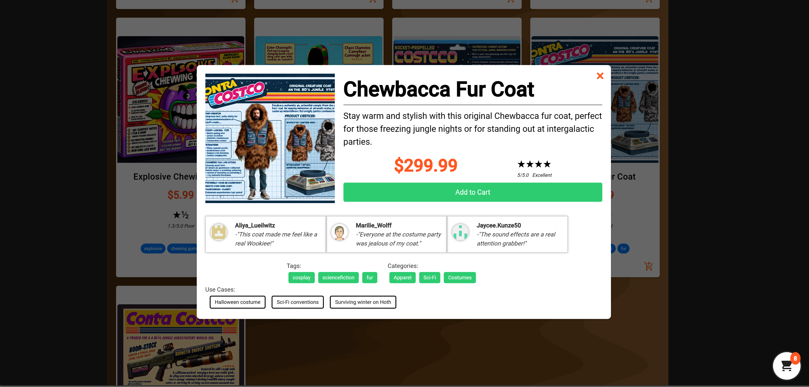

# Contra Costco - The Ultimate Jungle Rebel Warehouse

Welcome to Contra Costco - the wholesale warehouse store that caters exclusively to Contra rebels in the jungle! Dive into the nostalgia of the 80's arcade video game Contra while enjoying unbeatable deals on a wide range of fictional products generated by OpenAI's creativity. Our site is built with Angular, C# (ASP.NET), DynamoDB, and S3 to bring you a unique shopping experience.

## Table of Contents

- [Overview](#overview)
- [Features](#features)
- [Media](#media)
- [Getting Started](#getting-started)
- [Technologies Used](#technologies-used)
- [Example](#example)

## Overview

Contra Costco is your one-stop-shop for all the essentials a jungle rebel needs. Navigate our 80's arcade-themed website to discover a plethora of quirky and fictional products, each with its own unique story. With an intuitive interface and powerful filtering options, shopping has never been more entertaining.

## Features

### 1. Arcade-Themed Interface

Immerse yourself in the retro vibes of the Contra arcade game with our visually appealing and nostalgic design.

### 2. Dynamic Product Filtering

Easily filter products on the left sidebar by tags, price range, or user ratings to find the perfect gear for your rebel mission.

### 3. Shopping Cart

Keep track of your purchases by clicking the cart icon in the bottom right. The cart displays all items, quantities, and a grand total cost for your convenience.

### 4. Checkout Modal

Finalize your order seamlessly with our checkout modal, where you can enter your name, shipping and billing address, and credit card information securely.

### 5. Search Functionality

Use the search bar in the header to quickly find specific items, making your shopping experience efficient and enjoyable.

## Media

- Animated Example: 
- Screenshots:
  - 
  - 
  - 
  - 

## Getting Started

To start shopping at Contra Costco, follow these steps:

1. Clone the repository.
2. Install dependencies using `npm install` for Angular and set up your backend with C# (ASP.NET).
3. Connect to DynamoDB and S3 for a seamless experience.
4. Run the application locally to explore the jungle rebel warehouse.

## Technologies Used

- Angular
- C# (ASP.NET)
- DynamoDB
- S3
- OpenAI API (Python) for fictional product generation

## Example

Explore our fictional products with images, titles, descriptions, user testimonials, use cases, prices, and ratings. Let the Contra Costco experience begin!

_Disclaimer: Contra Costco is a satirical e-commerce website created for entertainment purposes only. The products and content are entirely fictional and not intended for real-world use._

Happy shopping, jungle rebels! 🌿🕹️
